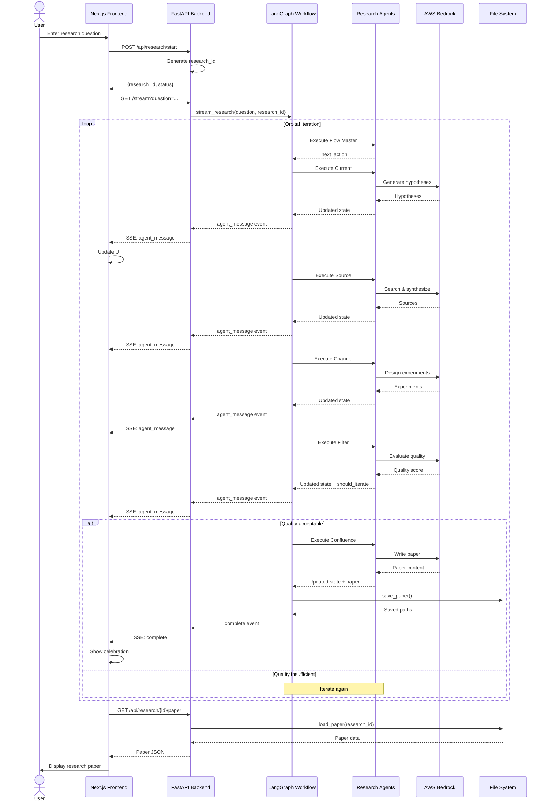
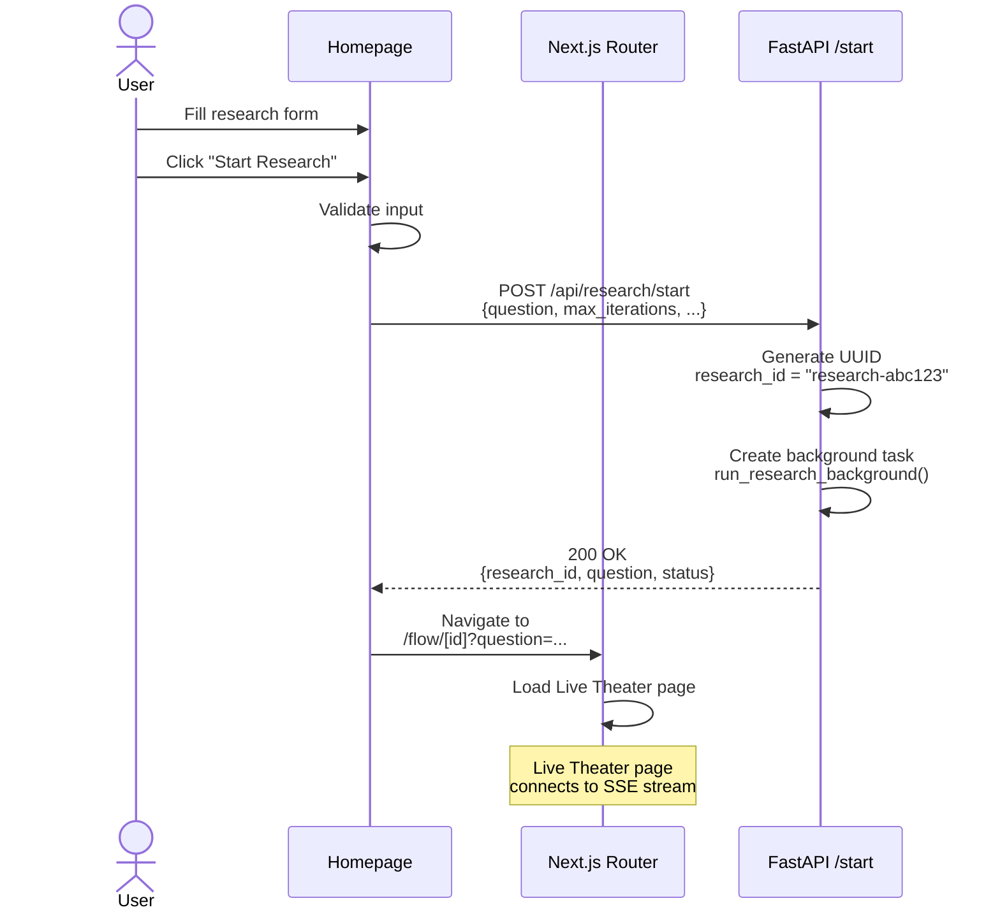
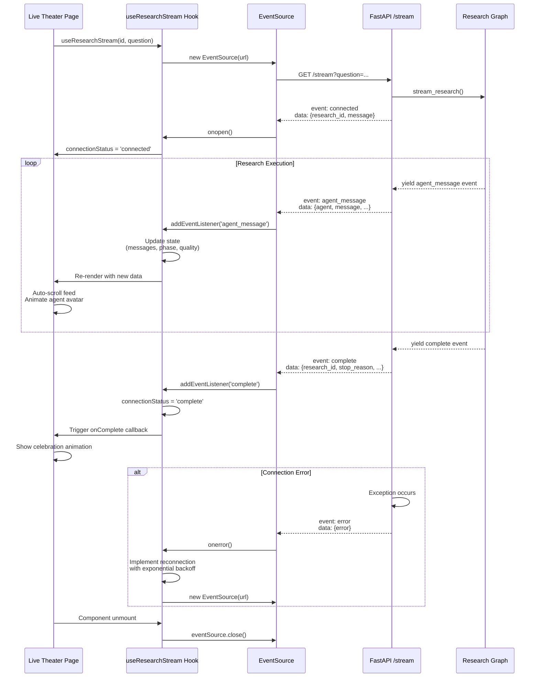
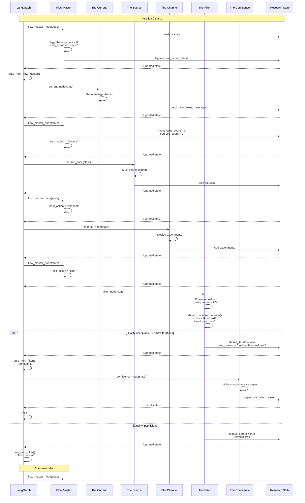
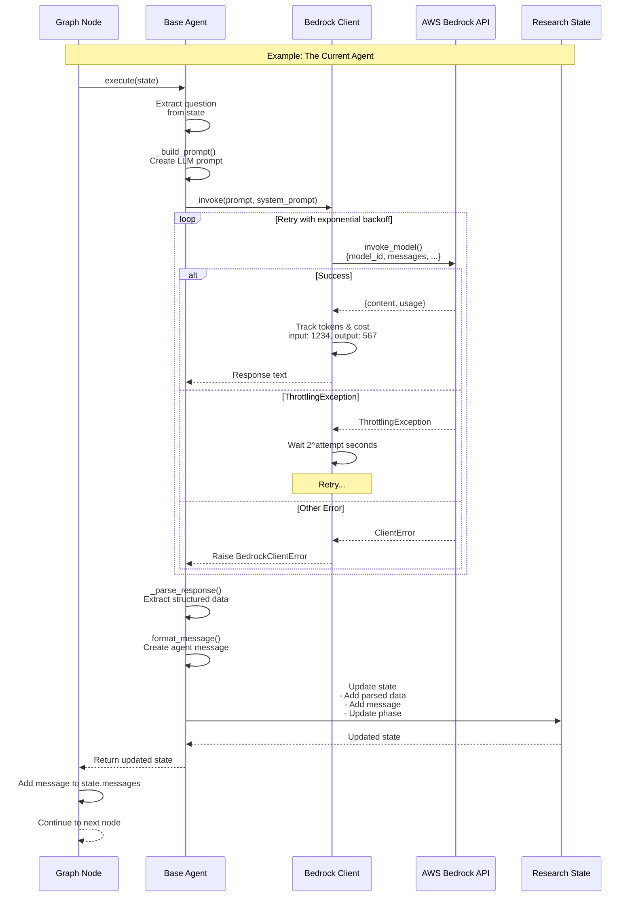
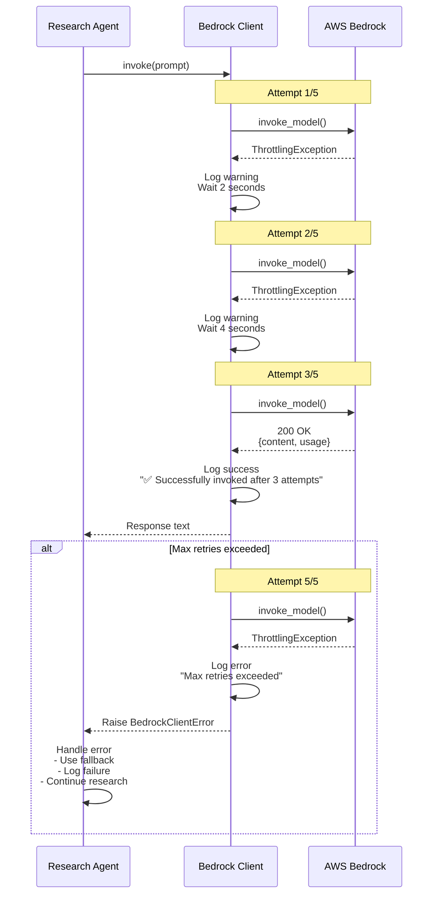
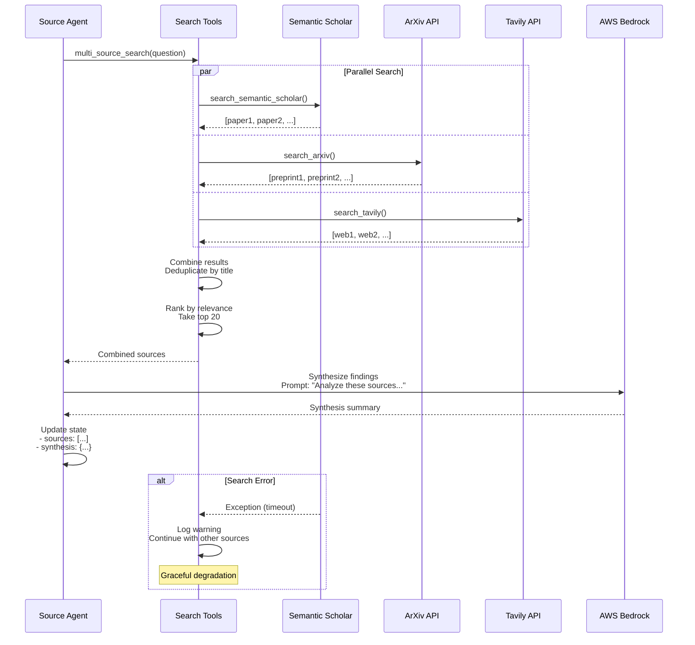
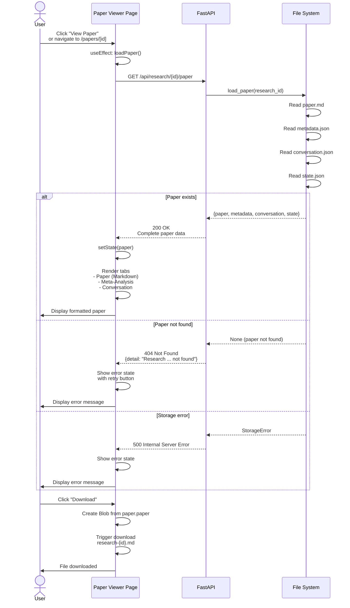
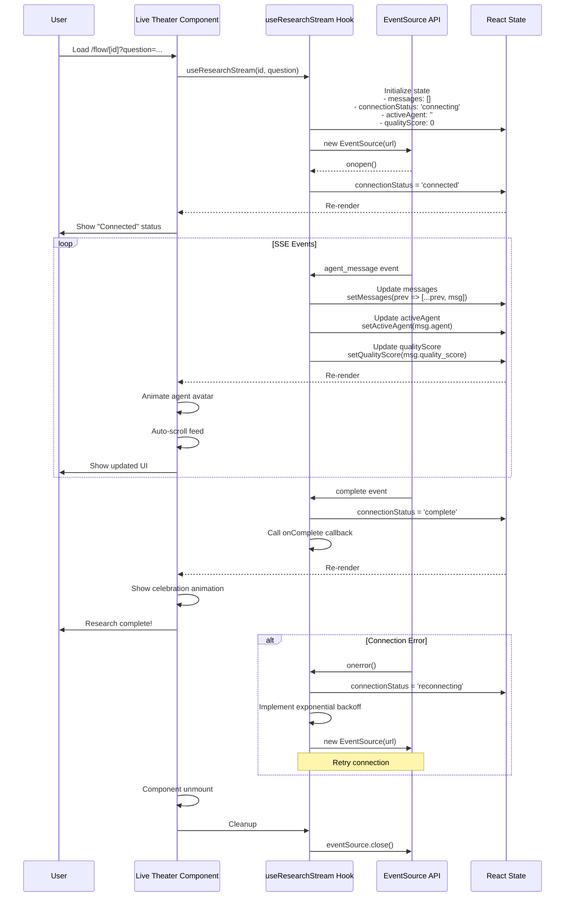
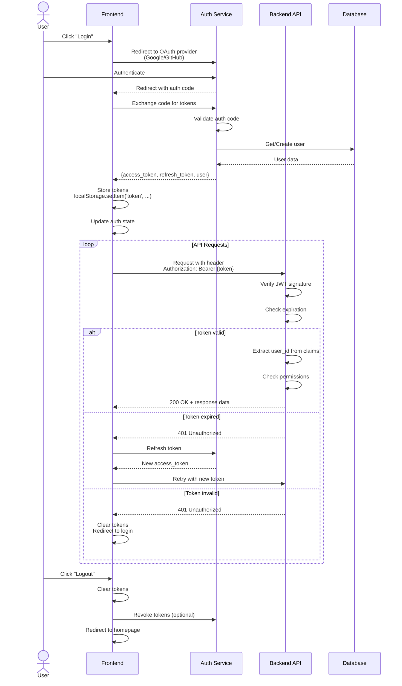

# FLUX Sequence Diagrams

## Table of Contents
1. [Complete Research Flow](#complete-research-flow)
2. [Research Initiation](#research-initiation)
3. [SSE Streaming Connection](#sse-streaming-connection)
4. [Orbital Iteration Cycle](#orbital-iteration-cycle)
5. [Agent Execution Flow](#agent-execution-flow)
6. [Error Handling & Retry](#error-handling--retry)
7. [Paper Retrieval](#paper-retrieval)

---

## Complete Research Flow

---

## Research Initiation

---

## SSE Streaming Connection

---

## Orbital Iteration Cycle

---

## Agent Execution Flow

---

## Error Handling & Retry

---

## Multi-Source Search Flow

---

## Paper Retrieval Flow

---

## Frontend State Management Flow

---

## Authentication Flow (Future)

---

## Conclusion

These sequence diagrams provide a comprehensive view of the interactions within the FLUX system:

1. **Complete Research Flow**: End-to-end process from user input to paper delivery
2. **Research Initiation**: How research sessions are started
3. **SSE Streaming**: Real-time connection and event handling
4. **Orbital Iteration**: The core iterative research cycle
5. **Agent Execution**: How individual agents work with LLMs
6. **Error Handling**: Retry logic and resilience patterns
7. **Paper Retrieval**: How completed papers are accessed

Each diagram highlights:
- **Participants**: The components involved
- **Message Flow**: Sequential and parallel operations
- **Decision Points**: Conditional logic and error handling
- **State Changes**: How data evolves through the system
- **User Experience**: Visible feedback and interactions

These diagrams serve as both documentation and design validation tools for the FLUX architecture.

